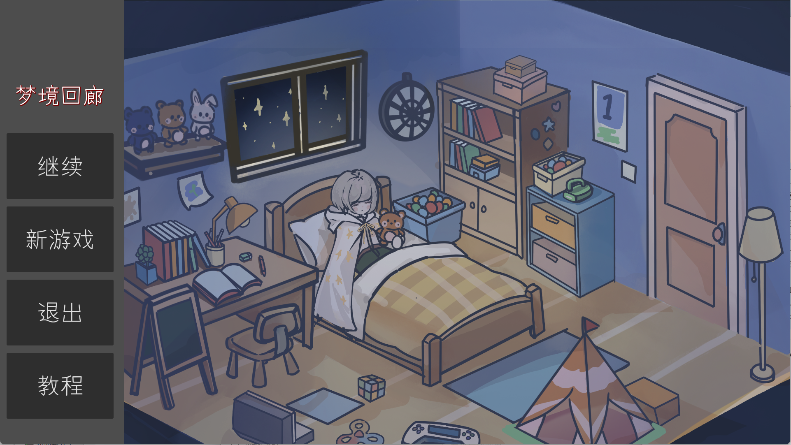
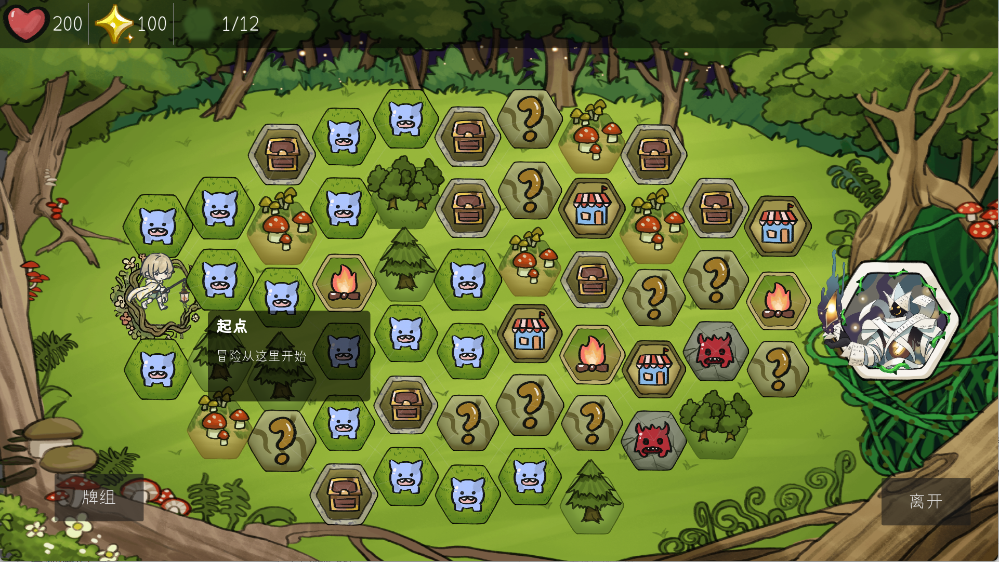
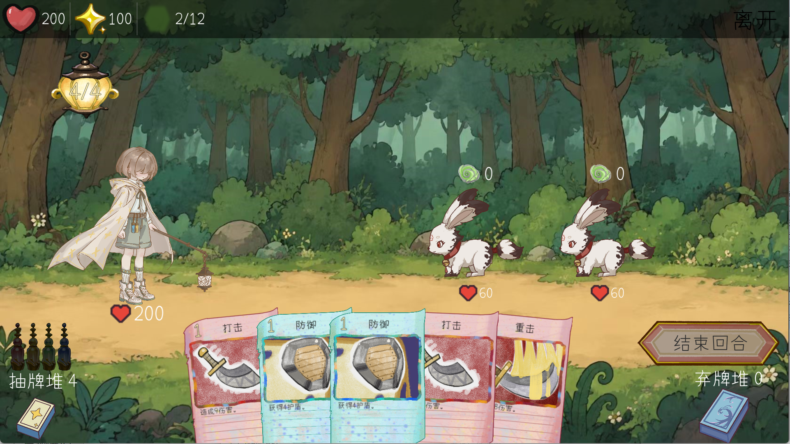

# 梦境回廊 Dream Corridor

回合制卡牌策略 Roguelike 项目作品集。玩家在梦境回廊中通过四色卡牌构筑、换手链与倍率系统，对抗现实压力在梦中的投影。

## 项目概览

- 游戏类型：回合制卡牌策略 Roguelike
- 开发环境：Godot 4 / C# / .NET
- 团队：非常六加一队
- 我的职责：策划为主，同时负责部分程序实现、Bug 修复与音频接入
- 项目状态：已完成比赛版本

## 我的工作

我在项目中主要负责策划工作，参与核心玩法、怪物与卡牌机制、地图和战斗体验设计；同时负责部分 Godot/C# 程序实现、Bug 修复、音频接入和测试报告整理。

## 核心设计

《梦境回廊》的核心机制是“颜色链 + 换手 + 倍率”。每张卡牌同时拥有费用与颜色，玩家连续打出同费用、不同颜色的卡牌时会触发换手，提升战斗倍率。机制鼓励玩家在费用曲线、颜色搭配、牌组精简和出牌顺序之间做策略取舍。

## 展示内容

- [项目介绍](docs/project-overview.md)
- [个人贡献说明](docs/personal-contribution.md)
- [AI 使用说明](docs/ai-usage.md)
- [Release 展示资源](https://github.com/T3L000/DreamCorridor-Portfolio/releases)

## 截图展示

## 素材说明

本仓库作为作品集展示页，不直接公开完整团队工程与大型安装包。展示视频、安装包等大型文件通过 GitHub Releases 或比赛提交平台提供。

